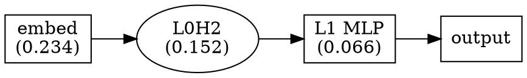

# Circuit Discovery API

Module for automated identification of computational circuits in neural networks.

## Classes

### CircuitDiscoverer

Main class for discovering important model components.

```python
from analysis.circuit_discovery import CircuitDiscoverer

discoverer = CircuitDiscoverer(model, device='cpu')
```

**Parameters:**
- `model` - HookedTransformer model instance
- `device` - Computation device

#### Methods

##### find_important_heads

```python
heads = discoverer.find_important_heads(
    dataset, threshold=0.01, n_samples=100
)
```

Find attention heads with importance above threshold.

**Parameters:**
- `dataset` - ModularArithmeticDataset instance
- `threshold` - Minimum importance score to include
- `n_samples` - Number of samples for evaluation

**Returns:** List of tuples (layer_idx, head_idx, importance)

##### find_important_mlps

```python
mlps = discoverer.find_important_mlps(
    dataset, threshold=0.01, n_samples=100
)
```

Find MLP layers with importance above threshold.

**Parameters:**
- `dataset` - ModularArithmeticDataset
- `threshold` - Minimum importance
- `n_samples` - Number of samples

**Returns:** List of tuples (layer_idx, importance)

##### discover_circuit

```python
circuit = discoverer.discover_circuit(
    dataset, n_samples=100, importance_threshold=0.01
)
```

Discover complete circuit including all important components.

**Parameters:**
- `dataset` - ModularArithmeticDataset
- `n_samples` - Number of samples
- `importance_threshold` - Minimum importance to include

**Returns:** `Circuit` object

##### export_circuit_diagram

```python
discoverer.export_circuit_diagram(circuit, path, format='json')
```

Export circuit to file.

**Parameters:**
- `circuit` - Circuit object
- `path` - Output path (Path or string)
- `format` - 'json' or 'dot' (for Graphviz)

---

### Circuit

Data class representing a discovered circuit.

```python
@dataclass
class Circuit:
    components: List[CircuitComponent]
    total_importance: float
    description: str
```

**Attributes:**
- `components` - List of CircuitComponent objects
- `total_importance` - Sum of component importances
- `description` - Human-readable circuit description

### CircuitComponent

Data class for individual circuit components.

```python
@dataclass
class CircuitComponent:
    name: str
    component_type: str  # 'embedding', 'attention_head', 'mlp', 'output'
    layer_idx: Optional[int]
    head_idx: Optional[int]
    importance: float
```

---

## Helper Functions

### generate_circuit_report

```python
from analysis.circuit_discovery import generate_circuit_report

report = generate_circuit_report(circuit)
```

Generate text report of discovered circuit.

**Parameters:**
- `circuit` - Circuit object

**Returns:** String report

---

## Export Formats

### JSON Format

```json
{
  "description": "Modular addition circuit",
  "total_importance": 0.4523,
  "components": [
    {
      "name": "embed",
      "component_type": "embedding",
      "layer_idx": null,
      "head_idx": null,
      "importance": 0.2341
    },
    {
      "name": "L0H2",
      "component_type": "attention_head",
      "layer_idx": 0,
      "head_idx": 2,
      "importance": 0.1523
    }
  ]
}
```

### DOT Format (Graphviz)



Render: `dot -Tpng circuit.dot -o circuit.png`

---

## Example Usage

```python
from Dataset.dataset import ModularArithmeticDataset
from models.hooked_transformer import create_hooked_model
from analysis.circuit_discovery import (
    CircuitDiscoverer,
    generate_circuit_report
)
from pathlib import Path

# Setup
dataset = ModularArithmeticDataset(p=17)
model = create_hooked_model(vocab_size=17, n_layers=2, n_heads=4)
# ... training ...

# Create discoverer
discoverer = CircuitDiscoverer(model)

# Find important attention heads
heads = discoverer.find_important_heads(dataset, threshold=0.01)
print("Important heads:")
for layer, head, importance in heads:
    print(f"  L{layer}H{head}: {importance:.4f}")

# Find important MLPs
mlps = discoverer.find_important_mlps(dataset, threshold=0.01)
print("Important MLPs:")
for layer, importance in mlps:
    print(f"  L{layer} MLP: {importance:.4f}")

# Full circuit discovery
circuit = discoverer.discover_circuit(dataset, n_samples=100)

print(f"\nCircuit: {circuit.description}")
print(f"Total importance: {circuit.total_importance:.4f}")
print(f"Components: {len(circuit.components)}")

# Generate report
report = generate_circuit_report(circuit)
print(report)

# Export
discoverer.export_circuit_diagram(circuit, Path('circuit.json'), format='json')
discoverer.export_circuit_diagram(circuit, Path('circuit.dot'), format='dot')
```

---

## Typical Results

For a 2-layer, 4-head transformer on mod-17 addition:

| Component | Typical Importance | Role |
|-----------|-------------------|------|
| embed | 0.20 - 0.35 | Input encoding |
| L0H0-H3 | 0.05 - 0.20 | Information routing |
| L0 MLP | 0.02 - 0.10 | Intermediate processing |
| L1H0-H3 | 0.02 - 0.10 | Result combination |
| L1 MLP | 0.05 - 0.15 | Output computation |

The specific head importances vary by random seed, but typically 1-2 heads are significantly more important than others.
