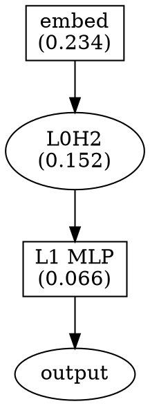

# Circuit Discovery Tutorial

This tutorial shows how to automatically identify important computational circuits in neural networks.

## Background

### What is a Circuit?

A circuit is a minimal subgraph of a neural network that performs a specific computation. For modular arithmetic, the circuit includes:

- **Input embeddings**: Encode numbers as vectors
- **Attention heads**: Combine information from different positions
- **MLP layers**: Perform nonlinear transformations
- **Output projection**: Produce final predictions

### Discovery Process

1. **Measure component importance**: How much does ablating each component hurt?
2. **Find minimal circuit**: Which components are essential?
3. **Trace information flow**: How does information move through the circuit?

## Setup

```python
import torch
from Dataset.dataset import ModularArithmeticDataset
from models.hooked_transformer import create_hooked_model
from analysis.circuit_discovery import (
    CircuitDiscoverer,
    generate_circuit_report
)

# Create dataset and model
p = 17
dataset = ModularArithmeticDataset(p=p)
model = create_hooked_model(vocab_size=p, n_layers=2, n_heads=4)
device = 'cpu'

# Assume model is trained
model.eval()
```

## Finding Important Attention Heads

```python
discoverer = CircuitDiscoverer(model, device=device)

# Find important attention heads
important_heads = discoverer.find_important_heads(
    dataset,
    threshold=0.01,  # Minimum importance to include
    n_samples=100
)

print("Important Attention Heads:")
for layer_idx, head_idx, importance in important_heads:
    print(f"  L{layer_idx}H{head_idx}: importance={importance:.4f}")
```

Expected output for modular arithmetic:
```
Important Attention Heads:
  L0H2: importance=0.1523
  L0H0: importance=0.0834
  L1H3: importance=0.0712
```

## Finding Important MLP Layers

```python
# Find important MLP layers
important_mlps = discoverer.find_important_mlps(
    dataset,
    threshold=0.01,
    n_samples=100
)

print("Important MLP Layers:")
for layer_idx, importance in important_mlps:
    print(f"  L{layer_idx} MLP: importance={importance:.4f}")
```

## Full Circuit Discovery

```python
# Discover complete circuit
circuit = discoverer.discover_circuit(
    dataset,
    n_samples=100,
    importance_threshold=0.01
)

print(f"\nCircuit Summary:")
print(f"  Components: {len(circuit.components)}")
print(f"  Total importance: {circuit.total_importance:.4f}")
print(f"  Description: {circuit.description}")

print("\nComponents:")
for comp in sorted(circuit.components, key=lambda c: c.importance, reverse=True):
    print(f"  {comp.name}: {comp.component_type}, importance={comp.importance:.4f}")
```

## Generating Circuit Report

```python
# Generate detailed report
report = generate_circuit_report(circuit)
print(report)

# Save report
with open('circuit_report.txt', 'w') as f:
    f.write(report)
```

## Exporting Circuit Diagram

```python
from pathlib import Path

# Export as JSON
discoverer.export_circuit_diagram(
    circuit,
    Path('circuit.json'),
    format='json'
)

# Export as DOT (for Graphviz)
discoverer.export_circuit_diagram(
    circuit,
    Path('circuit.dot'),
    format='dot'
)
```

### JSON Format

```json
{
  "description": "Modular addition circuit",
  "total_importance": 0.4523,
  "components": [
    {"name": "embed", "type": "embedding", "importance": 0.2341},
    {"name": "L0H2", "type": "attention_head", "importance": 0.1523},
    {"name": "L1_mlp", "type": "mlp", "importance": 0.0659}
  ]
}
```

### DOT Format



Render with: `dot -Tpng circuit.dot -o circuit.png`

## Understanding the Modular Arithmetic Circuit

For a typical 2-layer transformer on modular arithmetic:

### Embedding Layer
- Encodes numbers in circular arrangement
- High importance (carries input information)

### Layer 0 Attention
- **Key heads**: Move information between positions
- Typically 1-2 heads are important
- May implement "lookup" of operand positions

### Layer 0 MLP
- May not be critical for simple modular addition
- Can be ablated with moderate effect

### Layer 1 Attention
- Often less important than L0
- May refine or copy results

### Layer 1 MLP
- **Critical component**: Produces output logits
- High importance for final computation

## Analyzing Head Attention Patterns

```python
def visualize_attention_patterns(model, inputs, layer_idx, head_idx):
    """Visualize what an attention head attends to."""
    _, cache = model.run_with_cache(inputs)

    # Get attention pattern
    attn_key = f'blocks.{layer_idx}.attn.hook_pattern'
    if attn_key in cache:
        pattern = cache[attn_key][0, head_idx]  # [seq, seq]

        import matplotlib.pyplot as plt
        fig, ax = plt.subplots(figsize=(8, 6))
        im = ax.imshow(pattern.detach().numpy(), cmap='Blues')
        ax.set_xlabel('Key Position')
        ax.set_ylabel('Query Position')
        ax.set_title(f'Attention Pattern: L{layer_idx}H{head_idx}')
        plt.colorbar(im)
        plt.savefig(f'attention_L{layer_idx}H{head_idx}.png')

# Visualize important heads
sample_input = dataset.data['inputs'][:1]
for layer_idx, head_idx, _ in important_heads[:3]:
    visualize_attention_patterns(model, sample_input, layer_idx, head_idx)
```

## Comparing Circuits Across Seeds

```python
def compare_circuits(models, dataset, n_samples=100):
    """Compare circuits discovered across different training runs."""
    circuits = []

    for i, model in enumerate(models):
        discoverer = CircuitDiscoverer(model)
        circuit = discoverer.discover_circuit(dataset, n_samples=n_samples)
        circuits.append(circuit)
        print(f"Model {i}: {len(circuit.components)} components")

    # Find common components
    component_sets = [set(c.name for c in circuit.components) for circuit in circuits]
    common = component_sets[0].intersection(*component_sets[1:])
    print(f"Common components: {common}")

    return circuits
```

## Minimal Circuit Extraction

```python
def find_minimal_circuit(model, dataset, target_accuracy=0.95):
    """Find the smallest circuit that achieves target accuracy."""
    discoverer = CircuitDiscoverer(model)

    # Get all components ranked by importance
    full_circuit = discoverer.discover_circuit(dataset)
    sorted_components = sorted(
        full_circuit.components,
        key=lambda c: c.importance,
        reverse=True
    )

    # Greedily add components until target is reached
    minimal = []
    for comp in sorted_components:
        minimal.append(comp)
        # Test accuracy with only these components
        # (requires implementing selective activation)
        accuracy = test_circuit_accuracy(model, dataset, minimal)
        if accuracy >= target_accuracy:
            break

    return minimal

def test_circuit_accuracy(model, dataset, components):
    """Test accuracy using only specified components."""
    # Implementation: ablate all components NOT in the list
    pass
```

## Best Practices

1. **Use sufficient samples**: More samples = more stable importance estimates
2. **Check across seeds**: Robust circuits appear in multiple training runs
3. **Validate causally**: Confirm circuit is necessary AND sufficient
4. **Start with known circuits**: Compare to published results when available

## Common Findings

For modular arithmetic with 2-layer transformers:

| Component | Typical Importance | Role |
|-----------|-------------------|------|
| Embeddings | 0.20-0.35 | Encode circular structure |
| L0H2 (varies) | 0.10-0.20 | Primary attention head |
| L1 MLP | 0.05-0.15 | Output computation |
| Other heads | 0.01-0.05 | Minor roles |

## Next Steps

- [Path Patching](path-patching.md) - Trace information flow in detail
- [Causal Verification](causal-verification.md) - Verify circuit necessity
- [API Reference](../api/circuit-discovery.md) - Full API documentation
