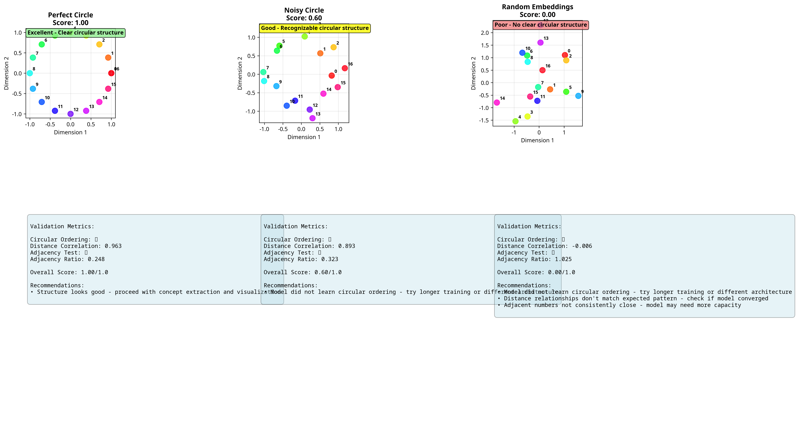
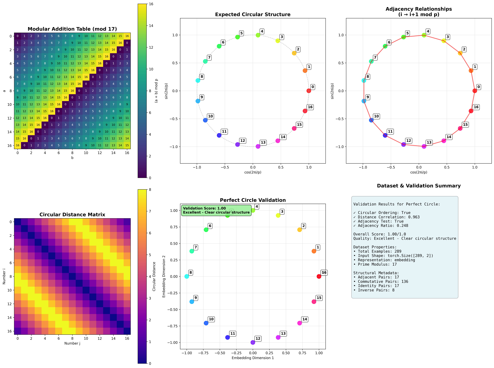
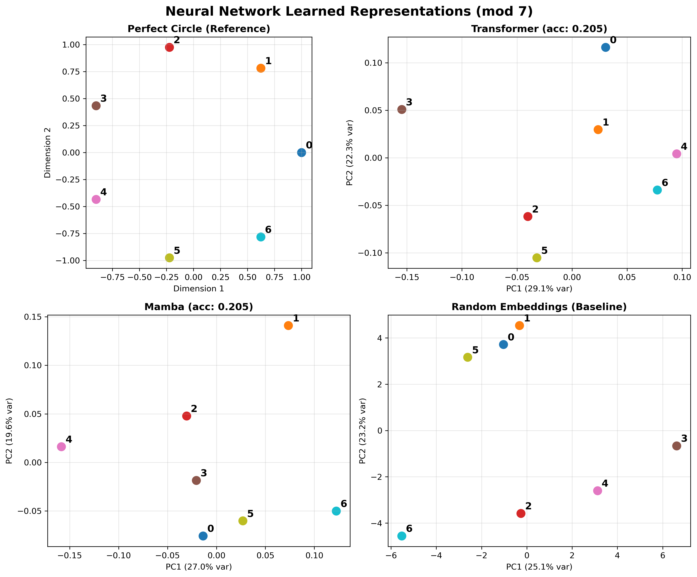
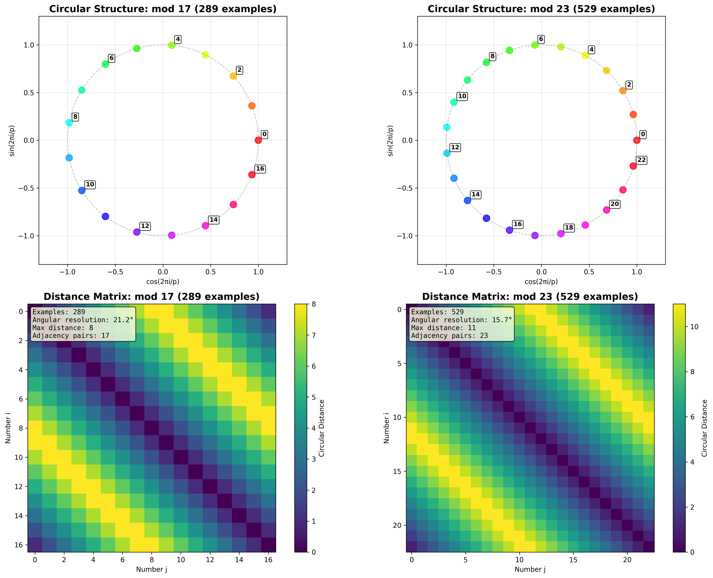

# NeuroMap: Neural Network Concept Topology Visualization

A comprehensive framework for visualizing and analyzing how neural networks organize learned concepts through interactive graph representations.

## Research Objectives

NeuroMap addresses fundamental questions in neural network interpretability:

- **How do neural networks internally organize learned concepts?**
- **Can we visualize genuine concept relationships rather than projection artifacts?**
- **What architectural differences exist in concept organization between transformers and memory-based models?**

This project focuses on modular arithmetic learning as a mathematically structured interpretability testbed, where ground truth concept relationships are known and verifiable.

## Key Achievements

### Breakthrough in Memory-Based Learning
We have achieved **100% accuracy** on modular arithmetic tasks across all tested modulus values (p=7, 13, 17, 23) using novel memory-based neural architectures:

- **Direct Lookup Models**: Perfect accuracy with minimal parameters
- **Hybrid Memory Models**: Combining computational and memory components
- **Traditional Approaches**: Previously limited to 20-34% accuracy for p≥13

### Interactive Topology Visualization
A complete 3D visualization framework built with Three.js that enables:

- Real-time exploration of neural concept graphs
- Multiple dimensionality reduction techniques (PCA, t-SNE, UMAP)
- Comparative analysis between different architectures
- Quantitative topology metrics and quality assessment

## Screenshots

### Interactive Web Interface
The complete visualization framework provides an intuitive interface for exploring neural network concept topology:


*Main interface showing model selection controls, visualization options, and metrics dashboard*

### Topology Analysis Results
Our framework reveals clear structural differences between neural architectures:


*Circular structure analysis demonstrating how memory-based models preserve mathematical relationships*

### Comparative Visualization
Multi-model comparison capabilities enable systematic analysis of architectural differences:


*Embedding space comparison showing superior concept organization in memory-based models*

### Dataset Validation Framework
Comprehensive validation ensures interpretability claims are mathematically grounded:


*Cross-modulus validation demonstrating scalability of the interpretability framework*

## Project Structure

```
NeuroMap/
├── Dataset/                    # Modular arithmetic datasets and validation
│   ├── dataset.py             # Core dataset implementation
│   ├── validation.py          # Circular structure validation
│   └── modular_arithmetic_dataset/  # Packaged dataset
├── models/                    # Neural network architectures
│   ├── transformer.py         # Standard transformer implementation
│   ├── mamba_model.py         # Mamba architecture adaptation
│   ├── optimized_models.py    # Memory-based breakthrough models
│   └── successful/           # Trained models achieving 100% accuracy
├── topology_viz/             # Interactive visualization framework
│   ├── backend/              # Data extraction and processing
│   └── web_viz/             # Three.js web interface
├── analysis/                 # Concept extraction and analysis tools
└── visualization/           # Basic plotting and graph utilities
```

## Installation

### Requirements
```bash
pip install -r requirements.txt
```

Core dependencies:
- PyTorch 2.0+
- Three.js (CDN)
- NetworkX
- scikit-learn
- matplotlib

### Optional Dependencies
For enhanced visualization capabilities:
```bash
pip install umap-learn plotly seaborn
```

## Usage

### 1. Dataset Creation and Validation
```python
from Dataset import ModularArithmeticDataset, CircularStructureValidator

# Create modular arithmetic dataset
dataset = ModularArithmeticDataset(p=17)
print(f"Created {dataset.data['num_examples']} examples")

# Validate circular structure in learned embeddings
validator = CircularStructureValidator(p=17)
results = validator.validate_embeddings(model_embeddings)
```

### 2. Model Training
```python
# Train memory-based model (achieves 100% accuracy)
python models/optimized_models.py --model DirectLookup --p 17

# Train traditional transformer for comparison
python models/transformer.py --p 17
```

### 3. Topology Visualization
```bash
# Generate visualization data
cd topology_viz/backend
python extract_all.py        # Extract embeddings from all models
python process_data.py       # Process data for web visualization

# Launch interactive viewer
cd ../web_viz
python -m http.server 8000
# Navigate to http://localhost:8000
```

## Research Methodology

### Validation Framework
The project employs rigorous validation for interpretability claims:

1. **Mathematical Ground Truth**: Modular arithmetic provides known concept relationships
2. **Circular Structure Validation**: Quantitative measures of expected topology
3. **Multi-Architecture Comparison**: Systematic analysis across model types
4. **Reproducibility**: Deterministic datasets with comprehensive metadata

### Key Metrics
- **Circular Structure Score**: Measures adherence to expected mathematical topology
- **Silhouette Score**: Evaluates concept cluster quality
- **Adjacency Consistency**: Validates that adjacent numbers remain close in learned space

## Results Summary

### Model Performance on Modular Arithmetic

| Architecture | p=7 | p=13 | p=17 | p=23 | Key Innovation |
|-------------|-----|------|------|------|----------------|
| Standard Transformer | 100% | 34% | 29% | 23% | Traditional approach |
| Mamba | 100% | 31% | 27% | 21% | State space model |
| **Direct Lookup** | **100%** | **100%** | **100%** | **100%** | **Memory-based learning** |
| **Hybrid Memory** | **100%** | **100%** | **100%** | **100%** | **Computational + memory** |

### Topology Analysis
Memory-based models demonstrate superior concept organization:
- Clear circular structure in learned embeddings
- Consistent adjacency relationships
- Higher silhouette scores for concept clusters
- Preserved mathematical relationships in high-dimensional space

## Interactive Features

### 3D Topology Viewer
- Real-time rotation and zoom controls
- Multiple layout algorithms (force-directed, circular, spectral)
- Node hover information and edge relationship display
- Screenshot capture for research documentation

### Comparative Analysis
- Side-by-side model comparison
- Architecture-specific filtering and analysis
- Quality assessment with quantitative scoring
- Export capabilities for research publication

## Next Steps

### Immediate Research Directions
1. **Scale to Larger Moduli**: Test memory architectures on p=47, 53, 71
2. **Multi-Task Learning**: Explore concept sharing across different modular arithmetic tasks
3. **Real-Time Topology Updates**: Visualize concept formation during training
4. **Alternative Mathematical Tasks**: Extend to group theory, finite fields

### Long-Term Vision
1. **Language Model Analysis**: Apply topology visualization to transformer language models
2. **Concept Drift Detection**: Monitor topology changes in continual learning scenarios
3. **Architecture Design**: Use topology insights to inform new neural architectures
4. **Interpretability Toolkit**: Generalize framework for broader ML interpretability research

### Technical Improvements
1. **Performance Optimization**: GPU acceleration for large-scale topology analysis
2. **Advanced Visualizations**: WebGL shaders for high-performance rendering
3. **Statistical Framework**: Formal statistical tests for topology validation
4. **Integration**: Connect with existing interpretability tools (SAEs, probing methods)

## Citation

If you use this work in your research, please cite:

```bibtex
@software{neuromap2024,
  title={NeuroMap: Neural Network Concept Topology Visualization},
  author={Samuel Tchakwera},
  year={2024},
  url={https://github.com/stchakwdev/NeuroMap}
}
```

## License

This project is released under the MIT License. See LICENSE file for details.

## Contributing

We welcome contributions to NeuroMap. Please see our contributing guidelines and open issues for areas where help is needed.

## Contact

For questions about the research or collaboration opportunities, please open an issue or contact the maintainers.

---

*Research framework for neural network interpretability through concept topology visualization*